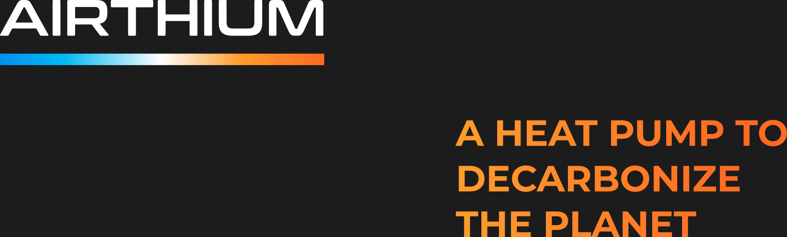

    
    

        

            <a href="https://wefunder.com/airthium" target="_blank"
                style="
                    padding: 10px 20px;
                    display: flex;
                    justify-content: center;
                    align-items: center;
                    cursor: pointer;
                    font-weight: 700;
                    line-height: 20px;
                    background: linear-gradient(90deg, #0091f2 0%, #00b9f3 100%);
                    -webkit-background-clip: text !important;
                    -webkit-text-fill-color: transparent;
                    background-clip: text;
                    text-fill-color: transparent;"
            >Invest now</a>
        

    

